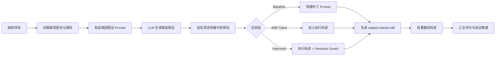

# LLM-Assisted Linux Kernel Bug Repair

一个面向课程设计与毕业设计实验的轻量级 Linux 内核缺陷辅助修复框架。项目使用大语言模型完成根因假设、自反思筛选和候选补丁生成，并通过 Semantic Guard 约束减少删除功能、提前返回等“截肢式修复”。

本 GitHub 版仓库保留了课程项目所需的核心代码、Prompt、8 个真实 kBenchSyz 样本、24 个模型输出、统计结果和 Markdown 说明文档。结项 Word 报告和汇报 PPT 暂作为本地提交材料保存，不纳入当前 GitHub 上传范围；虚拟环境、WSL 镜像、Linux 源码树、kGym 构建缓存和大体积原始 VM 日志也不纳入版本控制。

## 核心流程



完整的模块调用关系见 [CODE_FLOW.md](CODE_FLOW.md)。

## 目录结构

```text
.
├── data/
│   ├── demo/                 # 最小演示样本
│   └── selected/             # 8 个正式 kBenchSyz 样本
├── outputs/                  # 三组实验的模型输出
├── prompts/                  # 根因、反思、补丁与语义约束模板
├── results/                  # 评价、核验、编译和动态验证摘要
├── docs/                     # 报告、复现指南和案例分析
├── src/                      # 实验、检查、评价和验证脚本
├── .env.example              # API 环境变量示例
├── CODE_FLOW.md              # 代码流程与模块职责
└── requirements.txt
```

完整交付物索引见 `docs/final_deliverables.md`，复现实验步骤见 `docs/reproduction_guide.md`。

## 环境准备

推荐使用 Python 3.10 或更高版本：

```powershell
python -m venv .venv
.\.venv\Scripts\Activate.ps1
python -m pip install -r requirements.txt
```

## 快速演示

Mock 模式不需要 API Key，可验证三组实验的完整代码流程：

```powershell
python .\src\run_baseline.py --bug-dir .\data\demo\bug_demo_001 --provider mock
python .\src\run_with_trace.py --bug-dir .\data\demo\bug_demo_001 --provider mock
python .\src\run_improved.py --bug-dir .\data\demo\bug_demo_001 --provider mock
```

批量入口：

```powershell
python .\src\run_all_groups.py --provider mock --limit 1
```

## 使用真实模型

不要将真实密钥写入代码或提交到 Git。通过环境变量提供密钥：

```powershell
$env:DEEPSEEK_API_KEY="your_key"
python .\src\run_improved.py `
  --bug-dir .\data\demo\bug_demo_001 `
  --provider deepseek `
  --model deepseek-v4-pro
```

代码也支持 `openai` 和 `gemini` provider，对应环境变量见 `.env.example`。

## 三组实验

| 组别 | 输入 | 补丁模板 |
|---|---|---|
| Baseline | 崩溃报告、源码 | 普通补丁模板 |
| With Trace | 崩溃报告、源码、轨迹摘要 | 普通补丁模板 |
| Improved | 崩溃报告、源码、轨迹摘要 | Semantic Guard 模板 |

## 输出说明

每次运行会生成以下中间结果：

- `prompt_hypothesis.txt` 与 `hypotheses.json`
- `prompt_reflection.txt` 与 `reflection.json`
- `prompt_patch.txt` 与 `patch.json`
- `check_result.json`
- `run_metadata.json`

这些文件默认写入 `outputs/<group>/<bug_id>/`。本仓库保留了正式实验输出，便于课程评审直接检查。

重新运行模型会覆盖对应输出目录，建议复现实验前先备份历史输出，或使用 `--output-root` 指向临时目录。

## 结项结果摘要

本项目使用 8 个真实 kBenchSyz 样本，设置 Baseline、With Trace 和 Improved/Semantic Guard 三组，共获得 24 个 DeepSeek V4 Pro 输出。

| 组别 | plausible | helpful | incorrect | plausible+helpful |
|---|---:|---:|---:|---:|
| Baseline | 1/8 | 1/8 | 6/8 | 2/8 (25.0%) |
| With Trace | 0/8 | 3/8 | 5/8 | 3/8 (37.5%) |
| Improved | 1/8 | 3/8 | 4/8 | 4/8 (50.0%) |

真实 Linux parent commit 级源码适用性核验中，Improved 组 patch apply ok 为 5/8，高于 Baseline 的 3/8 和 With Trace 的 2/8。`bug_008 improved` 进一步完成局部编译和 3 次 x 6 分钟动态验证，均未复现目标 crash。

这些结果应表述为人工语义评价、真实源码适用性和代表案例动态验证结果，不能外推为 24 个输出的总体真实修复成功率。

## 注意事项

- 模型生成的候选补丁不能直接视为正确修复。
- 轻量检查只验证格式、原文匹配和风险特征，不替代真实内核编译与动态复现。
- 正式验证应在隔离环境中执行 `git apply`、局部编译、QEMU/KVM 复现及回归测试。
